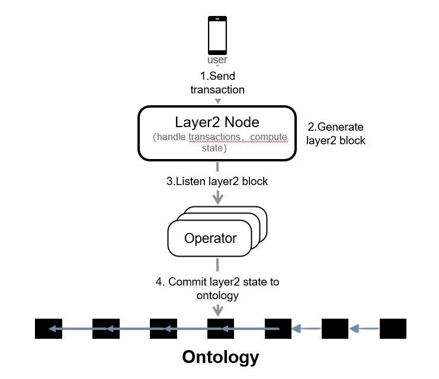
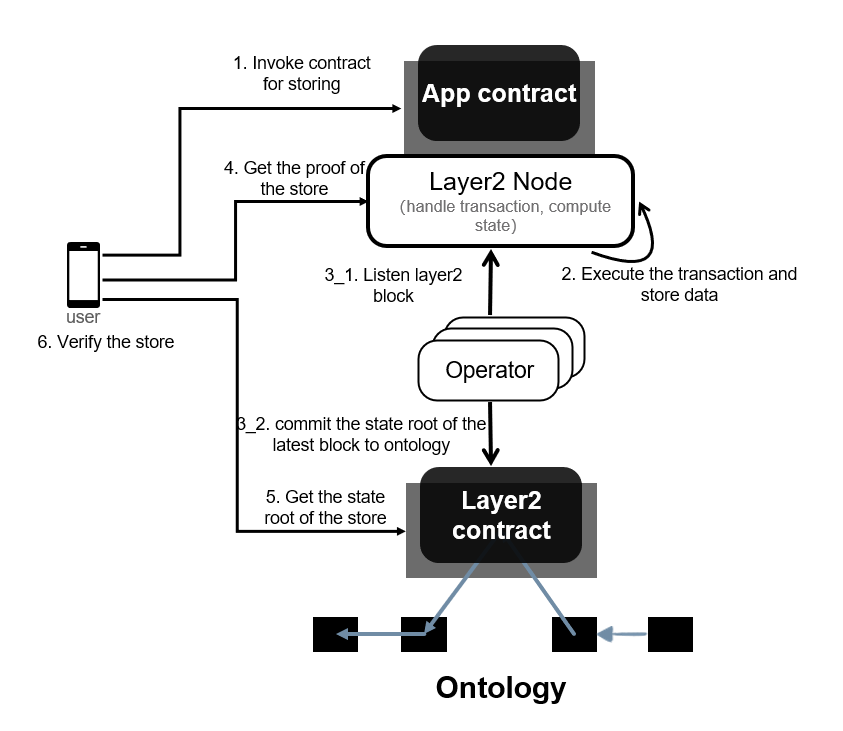

# Ontology Layer2

English|[中文](README_CN.md)

## Terminology

### Layer2 Transaction

An asset transfer between addresses or a smart contract invocation, signed and authorized by the user.

### Node

A Layer2 node collects all the user transactions, verifies them, and then executes them. The node is mainly responsible for executing the transactions that are part of a newly generated block, updates the state, and generates a state report that is readable by a Layer2 smart contract in order to set a security measure in place.

### Layer2 Blocks

A node periodically generates Layer2 blocks by collecting the transactions for a particular cycle and encapsulating them in a block.

### Layer2 State

When a node generates a block containing the transactions for a cycle and updates the state, all the relevant updated state data is sorted to generate an AVL tree. This merkle tree's root hash is then calculated, which is the Layer2 state for the corresponding block.

### Operator

The operator is a security daemon on Layer2 that monitors the transactions on Layer2 and verifies whether the sent tokens are transferred successfully to the Ontology main chain. The operator also periodically sends the Layer2 state proof to the Ontology main chain as evidence of transactions having taken place on Layer2.

## State Storage

In an AVL tree, the maximum height difference between any two leaf nodes must not be greater than 1. In case an update causes that situation to occur, the tree automatically balances itself to satisfy that condition. Using the primitive AVL tree, a node can store keys. But we use an algorithm with the AVL tree structure such that all the keys are stored as leaf nodes of the AVL tree, but the node locally stores keys that are only used to perform searches on the AVL tree .
With each new Layer2 block the state is updated and each new key inserted into the tree casues the AVL tree to rebalance and update the root. 

## Process Flow

###	Deposit to Layer2 

1.	The user carries out a deposit action on the Ontology main chain. The contract locks the user's deposit amount and records it in the Layer2 state. The current state of this deposit amount is "unreleased".

2.	The operator detects the deposit action on the main chain and submits the deposit transaction details to the Layer2 node.

3.	The node creates a new Layer2 block that encapsulates the deposit transaction along with transactions from different users. The Layer2 state is then updated with the execution of this block.

4.	An operator monitors the Layer2 nodes and the new blocks generated. When the updated Layer2 state is sent to the Ontology main chain, the request to release the deposit amount is sent along with it.


5.	The main chain releases the deposit amount and updates the deposit amount state to "released".

<div align=center></div>

### Withdraw to Ontology

1.	The user creates a Layer2 withdrawal transaction and sends it to the node.

2.	The node updates the state based on the withdrawal amount and generates a Layer2 block including the rest of the transactions.

3.	The operator sends the Layer2 block state to the Ontology main chain along with the withdrawal request.

4.	The main chain contract carries out the withdrawal transaction request and records the withdrawal action, and then sets the state to "unreleased".

5.	Once the state is confirmed, The main chain processes and executes the withdrawal release request, sends the withdrawal amount to the target account, and sets the withdraw state to "released".

<div align=center></div>

###	User Layer Transactions

1.	The user creates a Layer2 transfer transaction and sends it to the node.

2.	The node encapsulates the transactions including this transfer transaction to create a Layer2 block. 

3. The transactions of this block are executed by Layer2, and the updated block state is then sent to the Ontology main chain.

4.	System then awaits state confirmation.

<div align=center></div>

### Storage and Verification

1. The user invokes a Layer2 application contract method.

2. When this invocation transaction is included in a Layer2 block that is executed, the state is updated if the contract stores a value for a key, and a new state root is generated.

3. When the operator picks up this new Layer2 state it transmits it to the Ontology main chain.

4. The user fetches the proof from Layer2 using the key.

5. The user fetches the Layer2 state from the Ontology main chain.

6. The user verifies the stored value corresponding to the key using the proof and Layer2 state.

<div align=center></div>

## install

Please reference [Layer2 User Deployment Guide](https://github.com/ontio/layer2/blob/master/doc/Layer2_User_Deployment_Guide.md)

## Service

Network|Layer2 Node|Layer2 Contract
:--:|:--:|:--:
MainNet|http://107.155.55.167:40336|10c1b2b4e17ea5ed604d6cbff311330dd702bf97
TestNet|http://152.32.217.204:40336|10c1b2b4e17ea5ed604d6cbff311330dd702bf97

## Usage

Please use [Layer2 SDK](https://github.com/ontio/ontology-go-sdk)

Here is an illustration that demonstrates fetching and verifying the stored value from the Layer2 contract `7680bc3227089ee6ac790be698e88bcd0be04609`.

```go
func GetCommitedLayer2Height(ontsdk *ontology_go_sdk.OntologySdk, contract common.Address) (uint32, error) {
	tx, err := ontsdk.NeoVM.NewNeoVMInvokeTransaction(0, 0, contract, []interface{}{"getCurrentHeight", []interface{}{}})
	if err != nil {
		return 0, err
	}
	result, err := ontsdk.PreExecTransaction(tx)
	if err != nil {
		fmt.Printf("PreExecTransaction failed! err: %s", err.Error())
		return 0, err
	}
	if result == nil {
		fmt.Printf("can not find the result")
		return 0, fmt.Errorf("can not find current height!")
	}
	height, err := result.Result.ToInteger()
	if err != nil {
		return 0, fmt.Errorf("current height is not right!")
	}
	return uint32(height.Uint64()), nil
}


func GetCommitedLayer2StateByHeight(ontsdk *ontology_go_sdk.OntologySdk, contract common.Address, height uint32) ([]byte, uint32, error) {
	tx, err := ontsdk.NeoVM.NewNeoVMInvokeTransaction(0, 0, contract, []interface{}{"getStateRootByHeight", []interface{}{height}})
	if err != nil {
		fmt.Printf("new transaction failed!")
	}
	result, err := ontsdk.PreExecTransaction(tx)
	if err != nil {
		fmt.Printf("PreExecTransaction failed! err: %s", err.Error())
		return nil, 0, err
	}
	if result == nil {
		fmt.Printf("can not find the result")
		return nil, 0, fmt.Errorf("can not find state of heigh: %d", height)
	}
	tt, _ := result.Result.ToArray()
	if len(tt) != 3 {
		fmt.Printf("result is not right")
		return nil, 0, fmt.Errorf("result is not right, height: %d", height)
	}
	item0,_ := tt[0].ToString()
	item1,_ := tt[1].ToInteger()
	item2,_ := tt[2].ToInteger()
	fmt.Printf("item0: %s, item1: %d, item2: %d\n", item0, item1, item2)
	stateRoot, err := common.Uint256FromHexString(item0)
	if err != nil {
		return nil, 0, fmt.Errorf("state hash is not right, height: %d", height)
	}
	return stateRoot.ToArray(), uint32(item1.Uint64()), nil
}

func TestVerifyContractStore1(t *testing.T) {
	sdk := newLayer2Sdk()
	// 1. get the store key
	//    get the store data, store proof by the key
	key, _ := sdk.GetStoreKey(STORE_CONTRACT, []byte("hello"))
	store, err := sdk.GetStoreProof(key)
	if err  != nil {
		panic(err)
	}
	fmt.Printf("value: %s, proof: %s, height: %d\n", store.Value, store.Proof, store.Height)

    // 2. ensure the state root of the store is commited to ontology
	ont_sdk := newOntologySdk()
	contractAddress, _ := common.AddressFromHexString(LAYER2_CONTRACT)
	curHeight, err := GetCommitedLayer2Height(ont_sdk, contractAddress)
	if err != nil {
		panic(err)
	}
	for curHeight < store.Height {
		time.Sleep(time.Second * 1)
		curHeight, err = GetCommitedLayer2Height(ont_sdk, contractAddress)
		if err != nil {
			panic(err)
		}
	}

    // 3. get the state root which is commited to ontology
	stateRoot, height, err := GetCommitedLayer2StateByHeight(ont_sdk, contractAddress, store.Height)
	if err != nil {
		panic(err)
	}
	fmt.Printf("state root: %s, height: %d\n", hex.EncodeToString(stateRoot), height)

    // 4. verify the data is stored through the store proof and state root
	proof_byte, _ := hex.DecodeString(store.Proof)
	value_bytes, _ := hex.DecodeString(store.Value)
	result, err := sdk.VerifyStoreProof(key, value_bytes, proof_byte, stateRoot)
	if err != nil {
		panic(err)
	}
	if result {
		fmt.Printf("verify successful!\n")
	} else {
		fmt.Printf("verify failed!\n")
	}
}
```

Here is an illustration that demonstrates how to deposit from ontology to layer2 and how to withdraw from layer2 to ontology.

```
func ontologyDeposit(ontsdk *ontology_go_sdk.OntologySdk, payer *ontology_go_sdk.Account, contract ontology_common.Address, token []byte, amount uint64) (ontology_common.Uint256, error) {
	tx, err := ontsdk.NeoVM.NewNeoVMInvokeTransaction(2500, 400000, contract, []interface{}{"deposit", []interface{}{
		payer.Address, amount, token}})
	if err != nil {
		fmt.Printf("new transaction failed!")
	}
	ontsdk.SetPayer(tx, payer.Address)
	err = ontsdk.SignToTransaction(tx, payer)
	if err != nil {
		fmt.Printf("SignToTransaction failed!")
	}
	txHash, err := ontsdk.SendTransaction(tx)
	if err != nil {
		fmt.Printf("SignToTransaction failed! err: %s", err.Error())
	}
	return txHash, nil
}

// deposit to layer2
func TestOntologyDeposit2Layer2(t *testing.T) {
	ontSdk := newOntologySdk()
	contractAddress, _ := common.AddressFromHexString(LAYER2_CONTRACT)
	account_user, err := newOntologyUserAccount(ontSdk)
	if err != nil {
		panic(err)
	}
	tokenAddress, _ := hex.DecodeString("0000000000000000000000000000000000000002")
	txHash, err := ontologyDeposit(ontSdk, account_user, contractAddress, tokenAddress, 3000000000)
	if err != nil {
		panic(err)
	}
	fmt.Printf("hash: %s", txHash.ToHexString())
}

// withdraw to ontology
func layer2WithdrawTransfer(ontsdk *ontology_go_sdk.OntologySdk, payer *ontology_go_sdk.Account, from ontology_common.Address, amount uint64) (ontology_common.Uint256, error) {
	tx, err := ontsdk.Native.Ong.NewTransferTransaction(0, 20000, from, ontology_common.ADDRESS_EMPTY, amount)
	if err != nil {
		return ontology_common.UINT256_EMPTY, err
	}
	if payer != nil {
		ontsdk.SetPayer(tx, payer.Address)
		err = ontsdk.SignToTransaction(tx, payer)
		if err != nil {
			return ontology_common.UINT256_EMPTY, err
		}
	}
	return ontsdk.SendTransaction(tx)
}
```