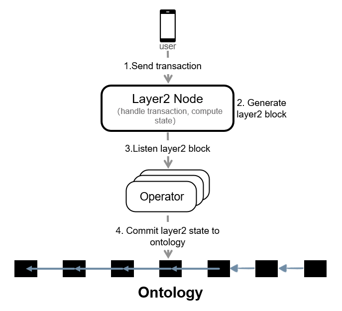

# Ontology Layer2

中文|[English](README.md)

## 名称解释

### Layer2交易

用户进行转账或者执行合约的请求，用户已经对其签名。

### Node

Node是Layer2交易收集器，它负责收集用户的Layer2交易，验证并执行交易，每生成一个Layer2区块，Node负责执行区块中的交易，更新状态，并生成需要提交到Layer2合约的State Root。

### Layer2区块

Node周期性的打包收集到的Layer2交易，生成一个包含该期间所有Layer2交易的区块，这就产生了一个新的Layer2区块。

### Layer2 State

Node执行Layer2区块中打包的交易，更新状态，将当前的全局状态数据生成一个AVL树，计算该AVL树的root hash，该root hash即为该区块的Layer2 State。

### Operator

Operator是Layer2的安全守护程序，负责监听Ontology主链是否有到Layer2的代币转移或者Layer2到Ontology主链的代币转移交易，同时Operator还负责周期性的将Layer2 State提交到Ontology主网作为Layer2的状态证明。

## 状态存储

在AVL树中，任何节点的两个子树高度相差不超过1，每当在更新时违反了此条件，就会重新平衡使得满足条件。在原始的AVL算法中，内部节点可以保存key。在这里使用的是AVL+算法，所有的key都保存在了叶子节点，而内部节点存储的key仅仅用来做树的搜索。

每当新的Layer2区块生成出来，状态的更新和新状态的插入将导致AVL+树的再平衡以及新的Root。

## 工作流程

###	Deposit到Layer2

1.	用户在Ontology主链进行deposit操作，主链合约锁定用户deposit的资金，记录这笔资金在Layer2的状态，此时状态为“未释放”。

2.	Operator监听到主链Ontology上有deposit操作，Operator会提交deposit到Layer2 Node。

3.	Node将该交易和收集的其他用户交易一起打包到一个新的Layer2区块，执行Layer2区块，释放deposit资金到指定用户，同时生成新的Layer2 State。

4.	Operator会监听新的Layer2区块，提交新的Layer2 State到Ontology主链时，会附带提交deposit已经释放的请求。

5.	主链合约执行deposit释放操作，修改deposit资金状态为“已释放”。

<div align=center></div>

### Withdraw到Ontology

1.	用户构造Withdraw的Layer2交易并提交给Node。

2.	Node会将该Withdraw交易以及其他用户交易一起打包到一个Layer2区块，并执行Layer2区块中的交易。

3.	Operator提交这个Layer2区块State到Ontology主链时，会附带提交Withdraw请求。

4.	主链合约执行Withdraw请求，记录一笔Withdraw资金记录，并设置状态为“未释放”。

5.	在State确认后，主链合约执行Withdraw释放请求，给目标账户转账，同时设置withdraw记录为“已释放“

<div align=center></div>

###	用户Layer交易

1.	用户构造Transfer的Layer2交易并提交给Node。

2.	Node打包该Transfer交易以及其他交易到一个新的Layer2区块，执行区块中的交易

3. Operator会提交这个Layer2区块State到Ontology主链。

4.	等待State确认。

### 用户Layer交易

<div align=center></div>

### 存储以及验证

1. 用户调用Layer2上的应用合约方法。

2. 该合约调用交易被打包到Layer2区块并被执行后，如果该合约有存储Value在Key上，则更新状态树，并生成新的State Root。

3. Operator监听到新的Layer2 State，提交该Layer2 State到ontology主链。

4. 用户从Layer2获取Key的存储Proof。

5. 用户从ontology主链获取Layer2 State。

6. 用户基于存储Proof和Layer2 State来验证Key的存储Value。

<div align=center></div>

## 安装

安装手册 [Layer2用户部署指导](https://github.com/ontio/layer2/blob/master/doc/Layer2_User_Deployment_Guide_CN.md)

## Service

Network|Layer2 Node|Layer2 Contract
:--:|:--:|:--:
MainNet|http://127.0.0.1:20336|0aad0408c6e4615b2f3f90c0c8c912649619a379
TestNet|http://127.0.0.1:20336|0aad0408c6e4615b2f3f90c0c8c912649619a379

## 使用

请使用[Layer2 SDK](https://github.com/ontio/ontology-go-sdk/tree/layer2)

以下是一个示例，从Layer2的合约7680bc3227089ee6ac790be698e88bcd0be04609中查询存储的Value并验证。

```
func GetCommitedLayer2Height(ontsdk *ontology_go_sdk.OntologySdk, contract common.Address) (uint32, error) {
	tx, err := ontsdk.NeoVM.NewNeoVMInvokeTransaction(0, 0, contract, []interface{}{"getCurrentHeight", []interface{}{}})
	if err != nil {
		return 0, err
	}
	result, err := ontsdk.PreExecTransaction(tx)
	if err != nil {
		fmt.Printf("PreExecTransaction failed! err: %s", err.Error())
		return 0, err
	}
	if result == nil {
		fmt.Printf("can not find the result")
		return 0, fmt.Errorf("can not find current height!")
	}
	height, err := result.Result.ToInteger()
	if err != nil {
		return 0, fmt.Errorf("current height is not right!")
	}
	return uint32(height.Uint64()), nil
}


func GetCommitedLayer2StateByHeight(ontsdk *ontology_go_sdk.OntologySdk, contract common.Address, height uint32) ([]byte, uint32, error) {
	tx, err := ontsdk.NeoVM.NewNeoVMInvokeTransaction(0, 0, contract, []interface{}{"getStateRootByHeight", []interface{}{height}})
	if err != nil {
		fmt.Printf("new transaction failed!")
	}
	result, err := ontsdk.PreExecTransaction(tx)
	if err != nil {
		fmt.Printf("PreExecTransaction failed! err: %s", err.Error())
		return nil, 0, err
	}
	if result == nil {
		fmt.Printf("can not find the result")
		return nil, 0, fmt.Errorf("can not find state of heigh: %d", height)
	}
	tt, _ := result.Result.ToArray()
	if len(tt) != 3 {
		fmt.Printf("result is not right")
		return nil, 0, fmt.Errorf("result is not right, height: %d", height)
	}
	item0,_ := tt[0].ToString()
	item1,_ := tt[1].ToInteger()
	item2,_ := tt[2].ToInteger()
	fmt.Printf("item0: %s, item1: %d, item2: %d\n", item0, item1, item2)
	stateRoot, err := common.Uint256FromHexString(item0)
	if err != nil {
		return nil, 0, fmt.Errorf("state hash is not right, height: %d", height)
	}
	return stateRoot.ToArray(), uint32(item1.Uint64()), nil
}

// verify the store
func TestVerifyContractStore1(t *testing.T) {
	sdk := newLayer2Sdk()
	// 1. get the store key
	//    get the store data, store proof by the key
	key, _ := sdk.GetStoreKey(STORE_CONTRACT, []byte("hello"))
	store, err := sdk.GetStoreProof(key)
	if err  != nil {
		panic(err)
	}
	fmt.Printf("value: %s, proof: %s, height: %d\n", store.Value, store.Proof, store.Height)

    // 2. ensure the state root of the store is commited to ontology
	ont_sdk := newOntologySdk()
	contractAddress, _ := common.AddressFromHexString(LAYER2_CONTRACT)
	curHeight, err := GetCommitedLayer2Height(ont_sdk, contractAddress)
	if err != nil {
		panic(err)
	}
	for curHeight < store.Height {
		time.Sleep(time.Second * 1)
		curHeight, err = GetCommitedLayer2Height(ont_sdk, contractAddress)
		if err != nil {
			panic(err)
		}
	}

    // 3. get the state root which is commited to ontology
	stateRoot, height, err := GetCommitedLayer2StateByHeight(ont_sdk, contractAddress, store.Height)
	if err != nil {
		panic(err)
	}
	fmt.Printf("state root: %s, height: %d\n", hex.EncodeToString(stateRoot), height)

    // 4. verify the data is stored through the store proof and state root
	proof_byte, _ := hex.DecodeString(store.Proof)
	value_bytes, _ := hex.DecodeString(store.Value)
	result, err := sdk.VerifyStoreProof(key, value_bytes, proof_byte, stateRoot)
	if err != nil {
		panic(err)
	}
	if result {
		fmt.Printf("verify successful!\n")
	} else {
		fmt.Printf("verify failed!\n")
	}
}
```

以下示例如何从ontology deposit到layer2，以及从layer2 withdraw到ontology

```
func ontologyDeposit(ontsdk *ontology_go_sdk.OntologySdk, payer *ontology_go_sdk.Account, contract ontology_common.Address, token []byte, amount uint64) (ontology_common.Uint256, error) {
	tx, err := ontsdk.NeoVM.NewNeoVMInvokeTransaction(2500, 400000, contract, []interface{}{"deposit", []interface{}{
		payer.Address, amount, token}})
	if err != nil {
		fmt.Printf("new transaction failed!")
	}
	ontsdk.SetPayer(tx, payer.Address)
	err = ontsdk.SignToTransaction(tx, payer)
	if err != nil {
		fmt.Printf("SignToTransaction failed!")
	}
	txHash, err := ontsdk.SendTransaction(tx)
	if err != nil {
		fmt.Printf("SignToTransaction failed! err: %s", err.Error())
	}
	return txHash, nil
}

// deposit to layer2
func TestOntologyDeposit2Layer2(t *testing.T) {
	ontSdk := newOntologySdk()
	contractAddress, _ := common.AddressFromHexString(LAYER2_CONTRACT)
	account_user, err := newOntologyUserAccount(ontSdk)
	if err != nil {
		panic(err)
	}
	tokenAddress, _ := hex.DecodeString("0000000000000000000000000000000000000002")
	txHash, err := ontologyDeposit(ontSdk, account_user, contractAddress, tokenAddress, 3000000000)
	if err != nil {
		panic(err)
	}
	fmt.Printf("hash: %s", txHash.ToHexString())
}

// withdraw to ontology
func layer2WithdrawTransfer(ontsdk *ontology_go_sdk.OntologySdk, payer *ontology_go_sdk.Account, from ontology_common.Address, amount uint64) (ontology_common.Uint256, error) {
	tx, err := ontsdk.Native.Ong.NewTransferTransaction(0, 20000, from, ontology_common.ADDRESS_EMPTY, amount)
	if err != nil {
		return ontology_common.UINT256_EMPTY, err
	}
	if payer != nil {
		ontsdk.SetPayer(tx, payer.Address)
		err = ontsdk.SignToTransaction(tx, payer)
		if err != nil {
			return ontology_common.UINT256_EMPTY, err
		}
	}
	return ontsdk.SendTransaction(tx)
}
```