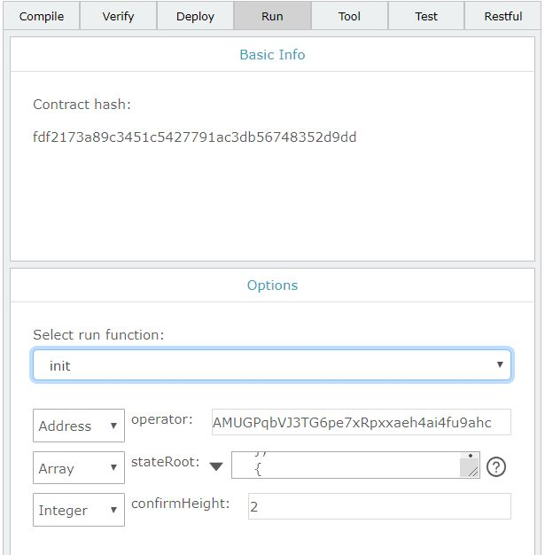

# Layer2 User Deployment Guide

English | [中文](Layer2_User_Deployment_Guide_CN.md)

## Background

In certain situations, the user may need to provide a low cost, low latency Layer2 service. In this case, deploying a standalone Layer2 service is an optimal solution.

In this guide we will talk about deploying a Layer2 service. Deploying an integrated Layer2 service includes the following:

1. Create a new Ontology wallet
2. Deploy a Layer2 contract on the Ontology main chain
3. Deploy a node that consolidates Layer2 transactions
4. Deploy a Layer2 security daemon operator
5. Deploy a Layer2 transaction query service
6. Deploy a Layer2 web service for the user

## Create a new Ontology wallet

The user needs to generate two wallet files, an Ontology main net wallet and a Layer2 node wallet. Since the Layer2 node wallet is compatible with the main net wallet, it can be generated using the main net wallet file.

The wallet file can be generated using the Cyano wallet by creating a new wallet and then exporting the wallet file, or by using the SDK to generate a new wallet file. 

Using the method described above, generate the `wallet_ontology.dat` wallet file that contains the Ontology main net account, and the `wallet_layer2.dat` wallet file that contains the Layer2 account.

## Deploying the Layer2 contract

Setting up a Layer2 contract on the Ontology main net involves:

1. Deploying the contract on the main net

2. Initializing the contract

### Deploying the contract

Ontology's online smart contract development IDE SmartX can be used to write, compile, deploy the Layer2 smart contract on Ontology main net. Once the Layer2 contract is deployed successfully, we will obtain the contract address.

**SmartX web address:** https://smartx.ont.io/#/

> Please note that SmartX is currently supported on Chrome browser only.

**Layer2 contract template:** https://github.com/ontio/layer2/blob/master/contract/layer2.py

### Initializing the Contract

After successful deployment, the contract can be initialized using SmartX by executing the `init()` method.



The `init()` method takes three parameters.

| Parameter     | Type    | Description                                                  |
| ------------- | ------- | ------------------------------------------------------------ |
| Operator      | Address | Layer2 security daemon account address, sends latest Layer2 state to the contract as proof to facilitate on-chain arbitration in case of off-chain malice by Layer2, Ontology main net account address |
| stateRoot     | Array   | Defines Layer2 genesis state                                 |
| confirmHeight | Integer | Height to determine state finalty after the transactions has taken place |

Sample `stateRoot`:

```json
[
    {
        "type": "ByteArray",
        "value": "0000000000000000000000000000000000000000000000000000000000000000"
    },
    {
        "type": "Integer",
        "value": 0
    },
    {
        "type": "String",
        "value": "1"
    }
]
```
| Field Type | Value Description                                                                                                                               |
| ---------- | ----------------------------------------------------------------------------------------------------------------------------------------------- |
| Bytearray  | Layer2 account state root hash, `0000000000000000000000000000000000000000000000000000000000000000` indicates account state was empty at genesis |
| Integer    | Block height at the respective state, initialized with `0`                                                                                      |
| String     | Version no., current version number is `1.0.0`                                                                                                  |


## Installing the Collector - Node

Please refer to the Node program guide and download and compile the source code to run the node. Please reference [Layer2 Node install guide](https://github.com/ontio/ontology/blob/layer2/README.md). After that, upload the ontology, `config.json` configuration file, and the `wallet_layer2.dat` Layer2 wallet file to the machine where the node is to be deployed. After uploading successfully, rename the wallet file from `wallet_layer2.dat` to `wallet.dat`.

Use the following command to start the node:

```shell
echo '1' |./ontology --minonglimit 0 --rpcport 20336 --nodeport 20338 --ws --wsport 20335 --rest --restport 20334 --layer2mode-gen-block-time 2 --layer2mode true --loglevel 1 --config config.json > log &
```

Enter the password as `1` when prompted to start the node service in the back end.

## Installing the Security Daemon - Operator

The security daemon operator uses a MySQL database and so MySQL needs to be installed before setting up the operator.

### Installing and Configuring MySQL

Install MySQL on a suitable platform and environment. Please follow [this link](https://www.mysql.com/products/community/) to download MySQL.

After successfully installing and setting up MySQL, run the following SQL commands to create a new Layer2 database:

```sql
CREATE SCHEMA IF NOT EXISTS `layer2` DEFAULT CHARACTER SET utf8;
USE `layer2`;

DROP TABLE IF EXISTS `chain_info`;
CREATE TABLE `chain_info` (
 `name` VARCHAR(100) NOT NULL COMMENT '链名称',
 `id`  INT(4) NOT NULL COMMENT '链id',
 `height` INT(4) NOT NULL COMMENT '解析的区块高度',
 PRIMARY KEY (`id`)
) ENGINE=INNODB DEFAULT CHARSET=utf8;

INSERT INTO `chain_info`(`name`,`id`,`height`) VALUES("ontology",1,0);
INSERT INTO `chain_info`(`name`,`id`,`height`) VALUES("layer2",2,0);

DROP TABLE IF EXISTS `deposit`;
CREATE TABLE `deposit` (
 `txhash`  VARCHAR(256) NOT NULL COMMENT '交易hash',
 `tt` INT(4) NOT NULL COMMENT '交易时间',
 `state` INT(1) NOT NULL COMMENT '交易状态',
 `height` INT(4) NOT NULL COMMENT '交易的高度',
 `fromaddress` VARCHAR(256) NOT NULL COMMENT '地址',
 `amount` BIGINT(8) NOT NULL COMMENT 'deposit的金额',
 `tokenaddress` VARCHAR(256) NOT NULL COMMENT '币地址',
 `id` INT(4) NOT NULL COMMENT '交易的ID',
 `layer2txhash` VARCHAR(256) DEFAULT NULL COMMENT 'layer2交易hash',
 PRIMARY KEY (`id`),
 UNIQUE (`txhash`)
) ENGINE=INNODB DEFAULT CHARSET=utf8;


DROP TABLE IF EXISTS `withdraw`;
CREATE TABLE `withdraw` (
 `txhash`  VARCHAR(256) NOT NULL COMMENT '交易hash',
 `tt` INT(4) NOT NULL COMMENT '交易时间',
 `state` INT(1) NOT NULL COMMENT '交易状态',
 `height` INT(4) NOT NULL COMMENT '交易的高度',
 `toaddress` VARCHAR(256) NOT NULL COMMENT '地址',
 `amount` BIGINT(8) NOT NULL COMMENT 'deposit的金额',
 `tokenaddress` VARCHAR(256) NOT NULL COMMENT '币地址',
 `ontologytxhash` VARCHAR(256) DEFAULT NULL COMMENT '交易hash',
 PRIMARY KEY (`txhash`)
) ENGINE=INNODB DEFAULT CHARSET=utf8;

DROP TABLE IF EXISTS `layer2tx`;
CREATE TABLE `layer2tx` (
 `txhash`  VARCHAR(256) NOT NULL COMMENT '交易hash',
 `state` INT(1) NOT NULL COMMENT '交易状态',
 `tt` INT(4) NOT NULL COMMENT '交易时间',
 `fee` BIGINT(8) NOT NULL COMMENT '交易手续费',
 `height` INT(4) NOT NULL COMMENT '交易的高度',
 `fromaddress` VARCHAR(256) NOT NULL COMMENT '地址',
 `tokenaddress` VARCHAR(256) NOT NULL COMMENT '执行的合约',
 `toaddress` VARCHAR(256) NOT NULL COMMENT '地址',
 `amount` BIGINT(8) NOT NULL COMMENT 'deposit的金额',
 PRIMARY KEY (`txhash`)
) ENGINE=INNODB DEFAULT CHARSET=utf8;

DROP TABLE IF EXISTS `layer2commit`;
CREATE TABLE `layer2commit` (
 `txhash`  VARCHAR(256) NOT NULL COMMENT '交易hash',
 `layer2height` INT(4) DEFAULT 0 COMMENT '交易的高度',
 `layer2msg` VARCHAR(1024) NOT NULL COMMENT 'laeyr2 msg',
 PRIMARY KEY (`txhash`)
) ENGINE=INNODB DEFAULT CHARSET=utf8;
```

### Deploying the Operator

Please refer to the operator guide and download and compile the source code. Please reference [Operator install guide](https://github.com/ontio/layer2/blob/master/operator/README.md). After that, upload the operator, `config.json` configuration file, and the `wallet_layer2.dat` and `wallet_ontology.dat` wallet files to the machine on which the operator is to be deployed.

Download and set up the operator as described in the guide and compile the source code.

You can modify the configuration file. Sample operator configuration:

```json
{
  "OntologyConfig":{
    "RestURL":"http://polaris4.ont.io:20336",
    "Layer2ContractAddress":"0aad0408c6e4615b2f3f90c0c8c912649619a379",
    "WalletFile":"./wallet_ontology.dat",
    "WalletPwd":"1",
    "GasPrice":2500,
    "GasLimit":6000000
  },
  "Layer2Config":{
    "RestURL":"http://localhost:20336",
    "WalletFile":"./wallet_layer2.dat",
    "WalletPwd":"1",
    "MinOngLimit": 100000000,
    "BlockDuration": 60,
    "MaxBatchSize": 10,
    "GasPrice":0,
    "GasLimit":2000000
  },
  "DBConfig":{
    "ProjectDBUrl":"127.0.0.1:3306",
    "ProjectDBUser":"root",
    "ProjectDBPassword":"root",
    "ProjectDBName":"layer2"
  }
}
```

|     Field      | Description                                                                                        |
| :------------: | -------------------------------------------------------------------------------------------------- |
| OntologyConfig | Contains the node address, layer2 contract address, main net wallet file path, and wallet password |
|  Layer2Config  | Contains node address, layer2 wallet file path, and wallet password                                |
|    DBConfig    | MySQL database URL, database username, password, and layer2 database name                          |


### Starting the Operator

Use the following command in the main directory to start the operator as a backend service:

```shell
nohup ./Operator &
```

## Deploying Layer2 Transaction Query Service

Currently, the Layer2 transaction query service needs to be deployed on the same node as the operator service.

Download and compile the server source code as per the server user guide. Please reference [Layer2 server install guide](https://github.com/ontio/layer2/blob/master/server/README.md). After that, upload then upload the server, the `config.json` configuration file to the machine where server is to be deployed.

Sample server configuration:

```json
{
  "log_level": 2,
  "rest_port": 30334,
  "version": "1.0.0",
  "http_max_connections":10000,
  "explorerdb_url":"127.0.0.1:3306",
  "explorerdb_user":"root",
  "explorerdb_password":"root1234",
  "explorerdb_name":"layer2"
}
```

The above configuration file contains access configuration to the MySQL database. The server and operator access the same MySQL database.

Use the following command to run the server:

```shell
nohup ./Server &
```

## Deploying Layer2 User Web Service

Compile the web service source code based on the web user guide. Configure the Node URL of the web to the above deployed Node URL, and set the Server URL as the above deployed server address.

Start the web service using the following command after completing configuration:

```shell
yarn run build
```


