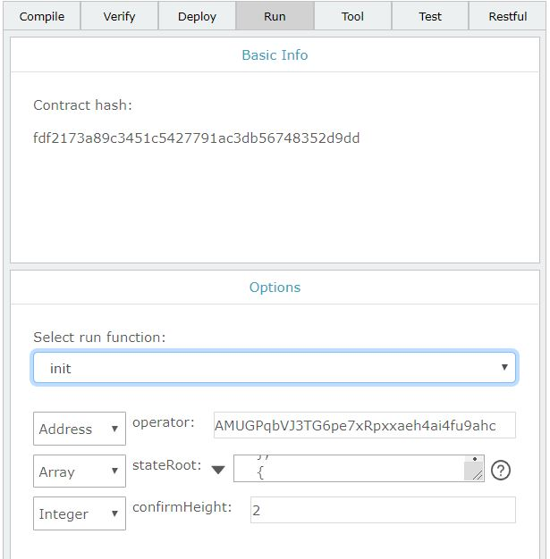

# Layer2 User Deploy Guide

[English](Layer2_User_Deployment_Guide.md)|中文

## 背景

在有些场景下，用户需要为自己的应用或者客户提供低延迟、低费用的Layer2服务，部署一个独立的Layer2服务是一个不错的选择。

该文档指导用户部署自己的Layer2服务，一个完整的Layer2服务部署包括以下几个部分：

1 准备钱包文件

2 在ontology主链安装Layer2合约

3 部署Layer2的交易收集程序Node

4 部署Layer2安全守护程序Operator

5 部署Layer2交易查询服务

6 部署Layer2用户web

## 准备钱包文件

需要准备ontology主网的钱包文件和Layer2 Node的钱包文件，因为目前Layer2 Node的钱包文件兼容ontology的钱包文件，可以使用生成ontology钱包文件的方式来生成layer2钱包。

可以用cyano钱包来生成一个账户并导出钱包文件，或者使用sdk程序来生成钱包文件。

使用上面的方式来生成包含ontology账户的钱包文件wallet_ontology.dat和包含layer2账户的钱包文件wallet_layer2.dat。

## 安装Layer2合约

在ontology主链安装Layer2合约包括两步：

1 在ontology主链部署合约

2 初始化合约

### 部署合约到ontology

在ontology合约开发工具smartx上按照指定合约开发部署流程将Layer2合约部署到ontology主链，在成功部署Layer2合约后，我们得到Layer2合约地址。

smartx工具web地址： https://smartx.ont.io/#/

Layer2合约代码： https://github.com/ontio/layer2/blob/master/contract/layer2.py

### 初始化合约

继续在ontology合约开发工具smartx上初始化合约，在smartx上成功部署合约到ontology后，执行该合约的init方法来初始化合约。



该合约接口有三个参数：
Address数据类型的operator、Array类型的stateRoot、Integer类型的confirmHeight。

operator指定了Laye2安全守护账户，安全守护账户会将Layer2最新状态提交到该Layer2合约作为证明，当在链下的Layer2有作恶或者纠纷时，可以依据此证明在链上裁决。ontology的安全守护账户就是第一步生成的ontology账户。

stateRoot指定了Layer2的创世状态，如以下创世状态
```
[
    {
        "type": "ByteArray",
        "value": "0000000000000000000000000000000000000000000000000000000000000000"
    },
    {
        "type": "Integer",
        "value": 0
    },
    {
        "type": "String",
        "value": "1"
    }
]
```
ByteArray的"0000000000000000000000000000000000000000000000000000000000000000"是Layer2账户状态树根hash，表明了Layer2在创世状态下账户状态为空。

Integer的0是状态高度，初始为0。

String的"1.0.0"是版本，当前版本为1.0.0。

confirmHeight指定了用户在Layer2进行withdraw后，需要多少个状态高度来确认withdraw有效。

## 安装收集程序Node

用户需要按照Node程序的指导手册下载和编译Node，请参考[Layer2 Node安装指导](https://github.com/ontio/ontology/blob/layer2/README_CN.md)，安装完成后，将Node、配置文件config.json以及上面准备的layer2钱包文件wallet_layer2.dat一起上传到部署机器上，重命名wallet_layer2.dat为wallet.dat。

使用以下命令来启动Node：
```
echo '1' | ./Node --layer2mode true --testmode-gen-block-time 6 --rpcport 20336 --nodeport 20338 --ws --wsport 20335 --rest --restport 20334 --loglevel 1 > log &
```
以上命令会在后台启动Node服务，输入钱包文件wallet.dat的密码'1'来启动Node。

## 安装安全守护程序Operator

Operator守护程序需要Mysql数据库，所以在安装Operator之前需要安装配置Mysql。

### 安装配置Mysql

选择适合自己的平台环境来安装Mysql，Mysql官方指导手册https://www.mysql.com/cn/products/community/。

Mysql安装完毕后，初始化数据库，在Mysql上创建layer2数据库：
```
CREATE SCHEMA IF NOT EXISTS `layer2` DEFAULT CHARACTER SET utf8;
USE `layer2`;

DROP TABLE IF EXISTS `chain_info`;
CREATE TABLE `chain_info` (
 `name` VARCHAR(100) NOT NULL COMMENT '链名称',
 `id`  INT(4) NOT NULL COMMENT '链id',
 `height` INT(4) NOT NULL COMMENT '解析的区块高度',
 PRIMARY KEY (`id`)
) ENGINE=INNODB DEFAULT CHARSET=utf8;

INSERT INTO `chain_info`(`name`,`id`,`height`) VALUES("ontology",1,0);
INSERT INTO `chain_info`(`name`,`id`,`height`) VALUES("layer2",2,0);

DROP TABLE IF EXISTS `deposit`;
CREATE TABLE `deposit` (
 `txhash`  VARCHAR(256) NOT NULL COMMENT '交易hash',
 `tt` INT(4) NOT NULL COMMENT '交易时间',
 `state` INT(1) NOT NULL COMMENT '交易状态',
 `height` INT(4) NOT NULL COMMENT '交易的高度',
 `fromaddress` VARCHAR(256) NOT NULL COMMENT '地址',
 `amount` BIGINT(8) NOT NULL COMMENT 'deposit的金额',
 `tokenaddress` VARCHAR(256) NOT NULL COMMENT '币地址',
 `id` INT(4) NOT NULL COMMENT '交易的ID',
 `layer2txhash` VARCHAR(256) DEFAULT NULL COMMENT 'layer2交易hash',
 PRIMARY KEY (`id`),
 UNIQUE (`txhash`)
) ENGINE=INNODB DEFAULT CHARSET=utf8;


DROP TABLE IF EXISTS `withdraw`;
CREATE TABLE `withdraw` (
 `txhash`  VARCHAR(256) NOT NULL COMMENT '交易hash',
 `tt` INT(4) NOT NULL COMMENT '交易时间',
 `state` INT(1) NOT NULL COMMENT '交易状态',
 `height` INT(4) NOT NULL COMMENT '交易的高度',
 `toaddress` VARCHAR(256) NOT NULL COMMENT '地址',
 `amount` BIGINT(8) NOT NULL COMMENT 'deposit的金额',
 `tokenaddress` VARCHAR(256) NOT NULL COMMENT '币地址',
 `ontologytxhash` VARCHAR(256) DEFAULT NULL COMMENT '交易hash',
 PRIMARY KEY (`txhash`)
) ENGINE=INNODB DEFAULT CHARSET=utf8;

DROP TABLE IF EXISTS `layer2tx`;
CREATE TABLE `layer2tx` (
 `txhash`  VARCHAR(256) NOT NULL COMMENT '交易hash',
 `state` INT(1) NOT NULL COMMENT '交易状态',
 `tt` INT(4) NOT NULL COMMENT '交易时间',
 `fee` BIGINT(8) NOT NULL COMMENT '交易手续费',
 `height` INT(4) NOT NULL COMMENT '交易的高度',
 `fromaddress` VARCHAR(256) NOT NULL COMMENT '地址',
 `tokenaddress` VARCHAR(256) NOT NULL COMMENT '执行的合约',
 `toaddress` VARCHAR(256) NOT NULL COMMENT '地址',
 `amount` BIGINT(8) NOT NULL COMMENT 'deposit的金额',
 PRIMARY KEY (`txhash`)
) ENGINE=INNODB DEFAULT CHARSET=utf8;

DROP TABLE IF EXISTS `layer2commit`;
CREATE TABLE `layer2commit` (
 `txhash`  VARCHAR(256) NOT NULL COMMENT '交易hash',
 `layer2height` INT(4) DEFAULT 0 COMMENT '交易的高度',
 `layer2msg` VARCHAR(1024) NOT NULL COMMENT 'laeyr2 msg',
 PRIMARY KEY (`txhash`)
) ENGINE=INNODB DEFAULT CHARSET=utf8;
```

### 部署Operator
用户按照Operator的指导手册下载和编译Operator，请参考[Operator安装指导](https://github.com/ontio/layer2/blob/master/operator/README_CN.md), 安装完成后，将Operator、配置文件config.json、准备的钱包文件wallet_layer2.dat和wallet_ontology.dat一起上传到部署机器。

修改Operator配置：
```
{
  "OntologyConfig":{
    "RestURL":"http://polaris4.ont.io:20336",
    "Layer2ContractAddress":"0aad0408c6e4615b2f3f90c0c8c912649619a379",
    "WalletFile":"./wallet_ontology.dat",
    "WalletPwd":"1",
    "GasPrice":2500,
    "GasLimit":6000000
  },
  "Layer2Config":{
    "RestURL":"http://localhost:20336",
    "WalletFile":"./wallet_layer2.dat",
    "WalletPwd":"1",
    "MinOngLimit": 100000000,
    "BlockDuration": 60,
    "MaxBatchSize": 10,
    "GasPrice":0,
    "GasLimit":2000000
  },
  "DBConfig":{
    "ProjectDBUrl":"127.0.0.1:3306",
    "ProjectDBUser":"root",
    "ProjectDBPassword":"root",
    "ProjectDBName":"layer2"
  }
}
```
主要包括：

ontology的访问配置：节点地址、以上第二步部署的layer2合约地址，以上第一步生成的ontology钱包文件wallet_ontology.dat及其密码。

Node的访问配置：节点地址、以上第一步生成的Layer2钱包文件wallet_layer2.dat及其密码。

Mysql数据库访问配置：数据库URL、用户名和密码以及Layer2数据库名称。

### 启动Operator

使用以下命令来启动Operator

```
nohup ./Operator &
```
以上命令行启动Operator作为后台服务运行。

## 部署Layer2交易查询服务

目前Layer2交易查询服务必须和Operator服务部署在同一个节点。

按照Server的用户指导手册下载和编译Server，请参考[Layer2查询服务安装指导](https://github.com/ontio/layer2/blob/master/server/README_CN.md)，安装完成后，将Server和配置文件config.json上传到部署机器，修改Server的配置：

```
{
  "log_level": 2,
  "rest_port": 30334,
  "version": "1.0.0",
  "http_max_connections":10000,
  "explorerdb_url":"127.0.0.1:3306",
  "explorerdb_user":"root",
  "explorerdb_password":"root1234",
  "explorerdb_name":"layer2"
}
```
配置主要是Mysql的访问配置，这里访问的Mysql和上面的Opeartor的Mysql是同一个。

使用以下命令行来启动Server

```
nohup ./Server &
```

## 部署Layer2用户web

按照web的用户指导手册下载和编译Web，配置web的Node URL为上面部署的Node地址，配置web的Server URL为上面部署的Server地址。

配置完成后启动Web。

```
yarn run build
```


